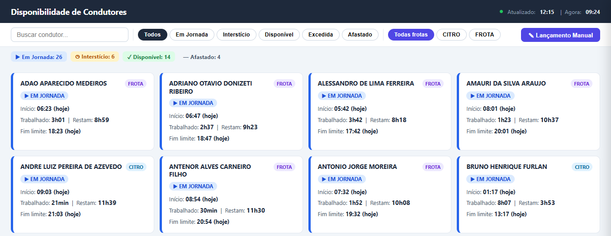

# Dashboard de Disponibilidade de Motoristas



Dashboard web em tempo real para gerenciamento de disponibilidade de motoristas, desenvolvido para empresas de transporte rodoviário de cargas e passageiros.

Desenvolvido e atualmente em uso na transportadora Novorumo, o sistema eliminou o controle manual de jornada em planilhas e reduziu o tempo de verificação de disponibilidade de motoristas de minutos para segundos.

## Como funciona

1. O sistema lê as fichas ponto exportadas pelo **ATSguiarh**
2. Calcula automaticamente a **jornada restante** e o **interstício** (período de descanso obrigatório) de cada motorista
3. Exibe o status operacional de toda a frota em um painel atualizado em tempo real

## Tecnologias

- **Python**
- **Railway** — hospedagem e deploy contínuo

## Funcionalidades

- Leitura automática de fichas ponto no formato ATSguiarh
- Cálculo de jornada e descanso conforme a **Lei 13.103/2015** (Lei do Motorista)
- Suporte a múltiplos usuários simultâneos
- Lançamento manual de jornadas
- Filtros por status operacional e frota
- Interface web acessível pelo navegador, sem necessidade de instalação

## Contexto regulatório

O sistema foi desenvolvido considerando as exigências da **Lei 13.103/2015**, que regulamenta a jornada de trabalho dos motoristas profissionais no Brasil, incluindo limites de horas ao volante, intervalos obrigatórios e períodos de descanso entre jornadas.

## Como usar

Para rodar localmente:

```bash
pip install -r requirements.txt
python servidor.py
```

Acesse `http://localhost:PORT` no navegador.
